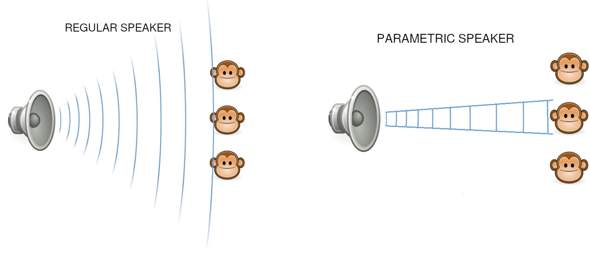

# Ultrasonic Directional Speaker for under $20

This repository contains:

1. C++ code for the STM32 Microcontroller
2. KiCad Schematic image for Circuit
3. KiCad Schematic image for Transducer Array

For building a Laser Directional Speaker, also known as a Parametric Speaker.

Related Video https://youtu.be/9hD5FPVSsV0
